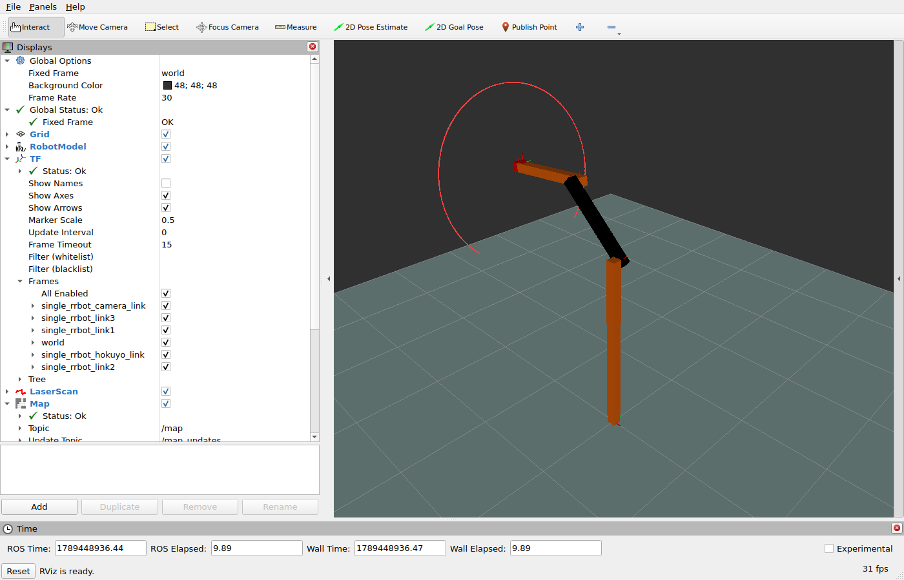

# Test the Dummy robot for conformance

This tutorial tests an unmodified ROS 2 node against its declared NoDL interface.
It uses the upstream `dummy_robot` demo so that the node implementation remains outside the tutorial.

```text
dummy_laser ── /scan (frame_id) ──> RViz
robot_state_publisher ── /tf ────> RViz
```

> **Launch → Conform → Compare candidate contracts**

## 1. Launch the upstream robot

Build the tutorial's contract package, then launch the unmodified Dummy robot:

```bash
colcon build --packages-select nodl_tutorial_dummy_robot
source install/setup.bash
ros2 launch dummy_robot_bringup dummy_robot_bringup_launch.py
```

In another terminal, open the tutorial's RViz view:

```bash
source install/setup.bash
rviz2 -d examples/nodl_tutorials/dummy_robot/rviz/dummy_robot.rviz
```

RViz should show the robot and its changing laser scan:



The `/dummy_laser` node publishes the scan consumed by RViz.
The tutorial does not replace or modify that node.

## 2. Verify the canonical contract

The node is expected to match this NoDL contract:

```{literalinclude} ../../../examples/nodl_tutorials/dummy_robot/nodl/dummy_laser.nodl.yaml
:language: yaml
```

In a third terminal, compare the running node with the contract:

```bash
source install/setup.bash
ros2 nodl conform /dummy_laser \
  --file examples/nodl_tutorials/dummy_robot/nodl/dummy_laser.nodl.yaml
```

```text
/dummy_laser: conforms
```

This result verifies the declared publisher name, message type, and reliability.
RViz verifies different properties, such as scan data and frame relationships.

## 3. Compare incompatible candidate contracts

Keep the upstream robot running.
Each candidate below changes one property of the canonical contract and demonstrates the corresponding diagnostic.

::::{tabs}
:::{tab} Topic

The candidate expects the laser scan on `/scan_regressed`:

```{literalinclude} ../../../examples/nodl_tutorials/dummy_robot/nodl/candidates/topic.nodl.yaml
:language: yaml
:emphasize-lines: 5
```

```bash
ros2 nodl conform /dummy_laser \
  --file examples/nodl_tutorials/dummy_robot/nodl/candidates/topic.nodl.yaml
```

```text
[extra] publishers '/scan': observed undeclared type 'sensor_msgs/msg/LaserScan'
[missing] publishers '/scan_regressed': expected type 'sensor_msgs/msg/LaserScan' was not observed
```

:::
:::{tab} Type

The candidate expects a `PointCloud` publisher instead of `LaserScan`:

```{literalinclude} ../../../examples/nodl_tutorials/dummy_robot/nodl/candidates/type.nodl.yaml
:language: yaml
:emphasize-lines: 6
```

```bash
ros2 nodl conform /dummy_laser \
  --file examples/nodl_tutorials/dummy_robot/nodl/candidates/type.nodl.yaml
```

```text
[type_mismatch] publishers '/scan': expected 'sensor_msgs/msg/PointCloud', got 'sensor_msgs/msg/LaserScan'
```

:::
:::{tab} Reliability

The candidate expects `BEST_EFFORT` reliability instead of `RELIABLE`:

```{literalinclude} ../../../examples/nodl_tutorials/dummy_robot/nodl/candidates/reliability.nodl.yaml
:language: yaml
:emphasize-lines: 10
```

```bash
ros2 nodl conform /dummy_laser \
  --file examples/nodl_tutorials/dummy_robot/nodl/candidates/reliability.nodl.yaml
```

```text
[qos_mismatch] publishers '/scan': reliability: expected BEST_EFFORT, got RELIABLE
```

:::
::::

The robot and its scan remain visible throughout these checks because its implementation never changes.
Only the expected contract changes.

Together, the examples show that conformance detects differences in endpoint names, message types, and QoS policies.
